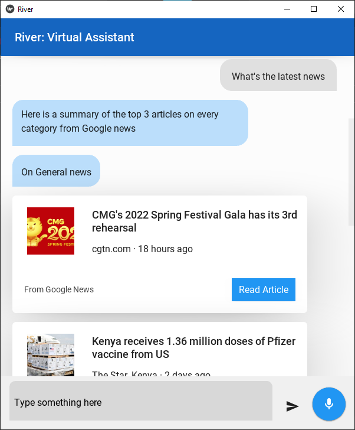
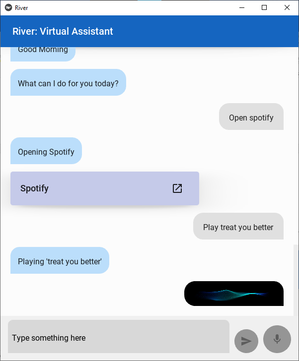

# River: Virtual Assistant
Ever been frustrated with how Cortana is not available in some regions, or lacks some features? River is here to fill the gap. It has cool features and is absolutely free.

## What can River do
River does tasks for you like opening apps, music and reading you the news.

As of now, River is a rule-based AI, meaning that you have to use commands that follow a specific format. We are working on making it actually understand language. Please be patient :)

The commands are listed in the commands section.

## Installation
River is only available on Windows for now

| Mode                    | Size   | Link          |
| :---------------------- | :----- | :-------------|
| Setup (**Recommended**) | 85 MB  | [river.exe](https://gitlab.com/fadhili_njagi/river/-/raw/master/dist/full_setup/river_setup.exe)|
| Portable executable     | 124 MB | [river_setup.exe](https://gitlab.com/fadhili_njagi/river/-/raw/master/dist/portable/river.exe)|

### 1. Setup mode
1. Download the setup from the link above.
2. Select a desired install location (default is Start Menu) and install.
3. Locate the installation folder. If you did not change it, paste '%AppData%\Microsoft\Windows\Start Menu\river' in the File explorer navigation bar and click enter.
4. Run **river.exe**.

### 2. Portable executable
Run the file as is. This will be slower than in setup mode

## Commands
You can give River a command by saying "River" or "Computer" to activate voice input mode, click mic button, or type into the text box and send.

| Feature | Command | Description |
| :------ | :-------| :-----------|
| Activate listening for voice command | "River", “Computer”, “Assistant”, "Hello River", "Hey River", "Hi Computer", "Hey Computer", "OK Computer", "OK River" | Activates listening for voice command. You can say the command next, after the listening notification has played |
| Greet the virtual assistant	| "hi", "hola", "hello", "hey", "how are you", or "how are you doing" | Greet the virtual assistant. The assistant will respond appropriately |
| Shut down PC |	“shutdown” |	Powers off PC |
| Hibernate PC |	“hibernate” |	Hibernates PC |
| Restart PC  |	“restart” |	Restarts PC |
| Sign out user |	“sign out” |	Signs out the logged in user |
| Time  |	"what's the time" or "what is the time"  |	Get the current time |
| Date  |	"what's the date today" or "what is the date today" |	Get the current date in terms of day of the week, date of the month, month and year |
| Google search |	“search <query>” | Opens a google search results page in your default browser |
| YouTube search  |	“YouTube <query>”  |	Opens a YouTube search results page in your default browser |
| Opening URLs |	“open URL <URL>” |	Opens specified URL in your default browser |
| Live radio |	“live radio” |	Opens https://onlineradiobox.com/ke , a website for playing live radio |
| Open apps |	“open <app>” |	Searches for apps whose names match the pattern provided. If only one is found, the app is opened. If there are multiple, the options are displayed for the user to select manually |
| Play music |	“play <music>” |	Searches for music files whose filenames match the pattern provided, in the Windows user’s Music folder. Music files are opened and played in the default media player. If there are multiple matching songs found, one is chosen at random |
| News summary | "what's the latest news", "what is the latest news", "what's on the news", "what is on the news", "read me the news", or "give me a news summary" |	Retrieves the top 3 articles from every news category on Google News, namely: general, local, business, technology, entertainment, sports, science, health, COVID  |
| Category specific news articles |	“read me the <category> news” |	Retrieves the top 5 articles from the specified news category on Google News. The available categories are: general, local, business, technology, entertainment, sports, science, health, COVID |
| Jokes |	"tell me a joke" or "make me laugh" |	Get a random joke from http://v2.jokeapi.dev. **Warning:** some jokes may be | upsetting or offensive. |
| General queries |	All commands that do not match any of the above commands |	Tries to retrieve a short answer first from | Wolfram alpha API, and falls back to Wikipedia API if that fails |
| Exit |	“exit” |	Close the assistant app and all its processes |

## Screenshots

## Issues, concerns or questions
In case of an issue, feedback or general question, please open an **issue** [here](https://gitlab.com/fadhili_njagi/river/-/issues).
It will only take a minute I promise.

Made with ❤️ by Fadhili Njagi.